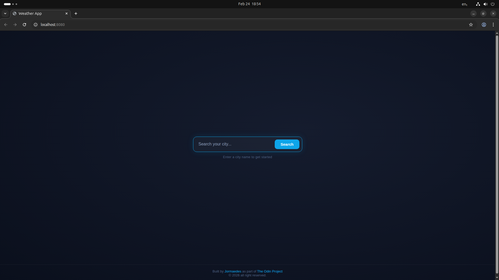
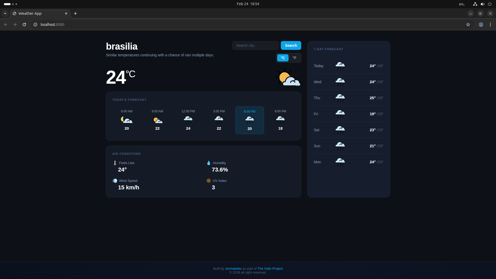

# 🌤️ Weather App

A weather forecast web application built as part of [The Odin Project](https://www.theodinproject.com/) curriculum. The primary goal of this project was to practice consuming external APIs, handling asynchronous JavaScript, and structuring code into clean, decoupled modules.

> Live demo: [weather-app](https://jormaedes.github.io/weather-app/)

---

## 📸 Preview

| Search Screen | Weather Screen |
|---|---|
|  |  |

---

## ✨ Features

- 🔍 Search weather for any city in the world
- 🌡️ Current temperature with weather icon
- ⏱️ Hourly forecast for the current day (6 time slots)
- 📅 7-day forecast with min/max temperatures
- 💧 Air conditions — feels like, humidity, wind speed, UV index
- 🔁 Toggle between °C and °F without precision drift
- ⌨️ Search via button click or `Enter` key

---

## 🛠️ Built With

- **JavaScript (ES6+)** — classes, async/await, modules
- **Webpack** — module bundling and asset management
- **CSS3** — custom properties, CSS Grid, Flexbox
- **[Visual Crossing Weather API](https://www.visualcrossing.com/)** — real-time weather data
- **[Visual Crossing Weather Icons](https://github.com/visualcrossing/WeatherIcons)** — SVG weather icons

---

## 🏗️ Project Structure

```
src/
├── index.js              # Entry point — wires modules together
├── models/
│   ├── WeatherAPI.js     # API calls and error handling
│   └── UI.js             # DOM rendering and event binding
├── styles/
│   └── style.css
└── template.html
```

### Module responsibilities

**`WeatherAPI.js`** — isolated API layer. Responsible only for fetching and returning raw data from Visual Crossing. Returns `null` on error so the UI can handle it gracefully.

**`UI.js`** — handles all DOM interaction: rendering current conditions, hourly slots, 7-day forecast, and the °C/°F toggle. Receives the fetch function as a callback injected by `App`, avoiding circular dependencies.

**`index.js`** — orchestrates the application. Instantiates `WeatherAPI`, creates the `App` class, and injects the fetch callback into `UI`.

---

## 🔑 Key Technical Decisions

**No circular dependencies** — `UI.js` does not import `App`. Instead, `index.js` injects the data-fetching function into `UI` via `setSearchCallback()`, keeping modules truly decoupled.

**Raw data as single source of truth** — temperature conversions between °C and °F never read from the DOM. The original API response (in Fahrenheit) is stored in `_rawData` and `render()` is called fresh on each toggle, eliminating precision drift from repeated conversions.

**Timezone-safe date parsing** — day dates are parsed as `new Date(datetime + 'T00:00:00')` to force local timezone interpretation and avoid off-by-one day errors caused by UTC parsing.

---

## 🚀 Getting Started

### Prerequisites
- Node.js and npm installed

### Installation

```bash
# Clone the repository
git clone https://github.com/jormaedes/weather-app.git
cd weather-app

# Install dependencies
npm install

# Start development server
npm run dev

# Build for production
npm run build
```

### API Key

This project uses the [Visual Crossing Weather API](https://www.visualcrossing.com/). The free tier is sufficient for development. Replace the key in `WeatherAPI.js`:

```js
this._key = "YOUR_API_KEY_HERE";
```

> ⚠️ For production applications, API keys should never be exposed in frontend code. Store them in environment variables on a backend server. For this learning project, the free-tier key has no financial consequences if exposed.

---

## 📚 What I Learned

- How to consume a REST API with `fetch` and `async/await`
- Structuring applications into decoupled modules
- Avoiding circular dependencies through dependency injection
- The importance of keeping a single source of truth for state
- Webpack configuration for a vanilla JS project

---

## 🔮 Possible Improvements

- [ ] Loading spinner while fetching data
- [ ] Geolocation support to auto-detect the user's city
- [ ] Move API key to a serverless backend (Vercel/Netlify functions)
- [ ] Responsive design for mobile
- [ ] Error state UI instead of `alert()`

---

## 👤 Author

**Jormaedes**
- GitHub: [@jormaedes](https://github.com/jormaedes)
- Project: [The Odin Project — JavaScript Course](https://www.theodinproject.com/paths/full-stack-javascript/courses/javascript)
